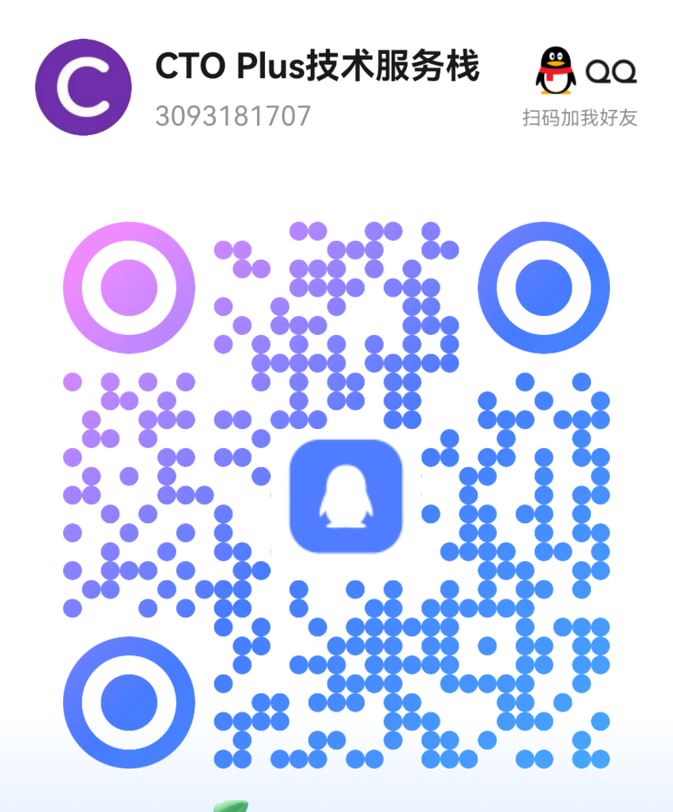
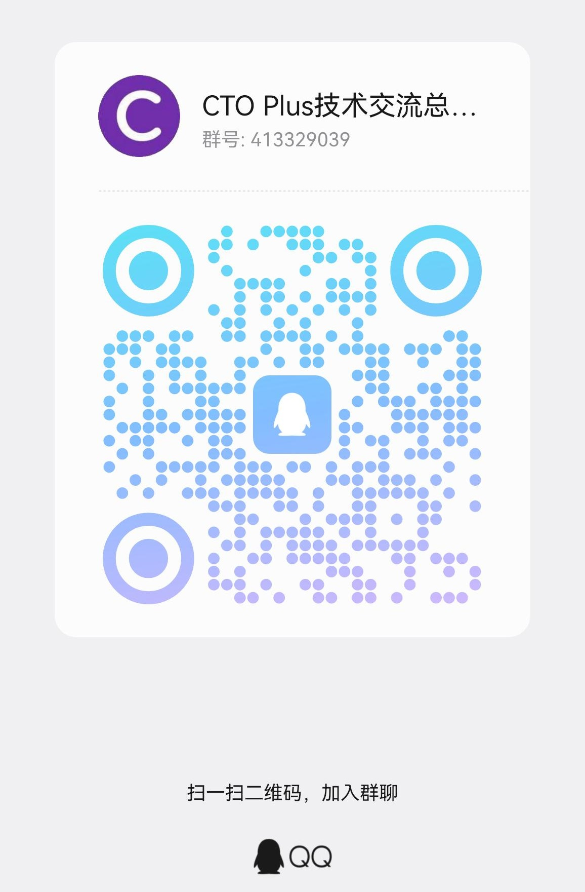
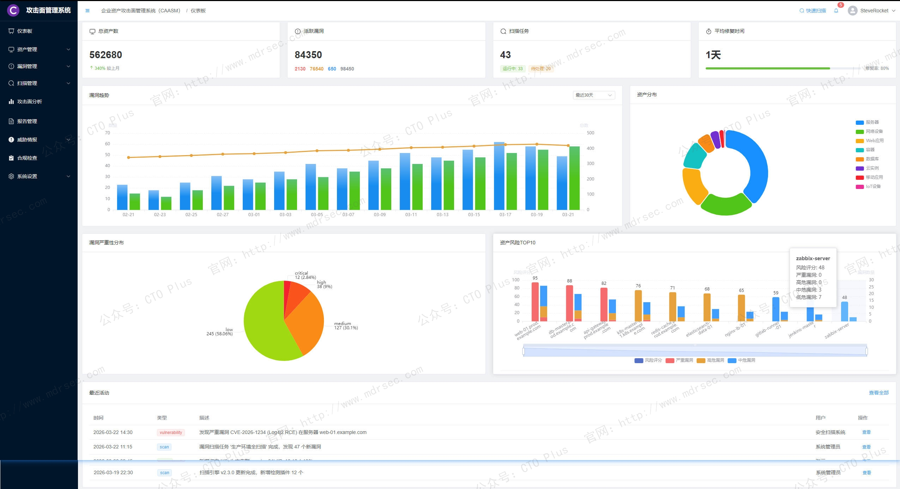
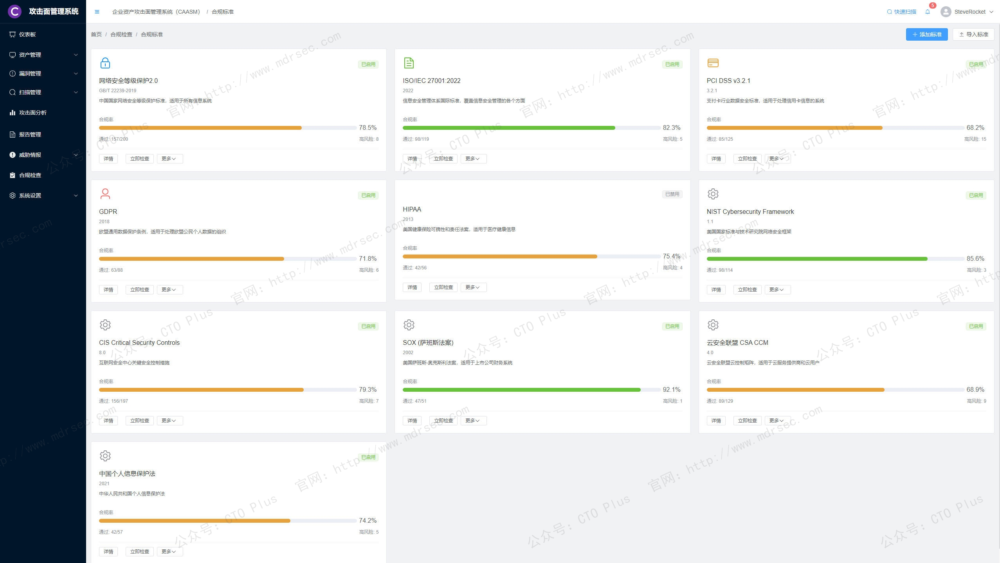
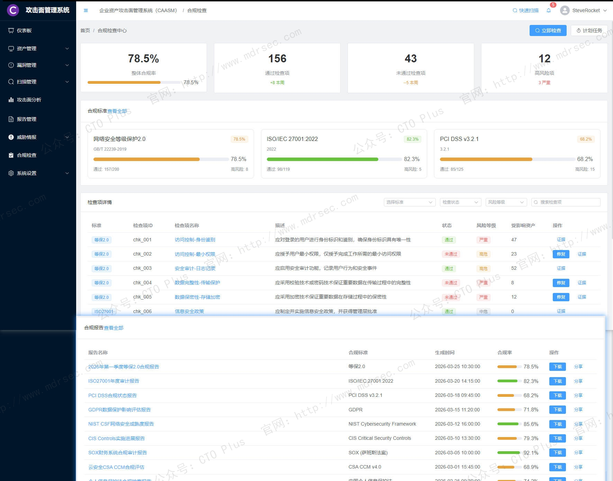
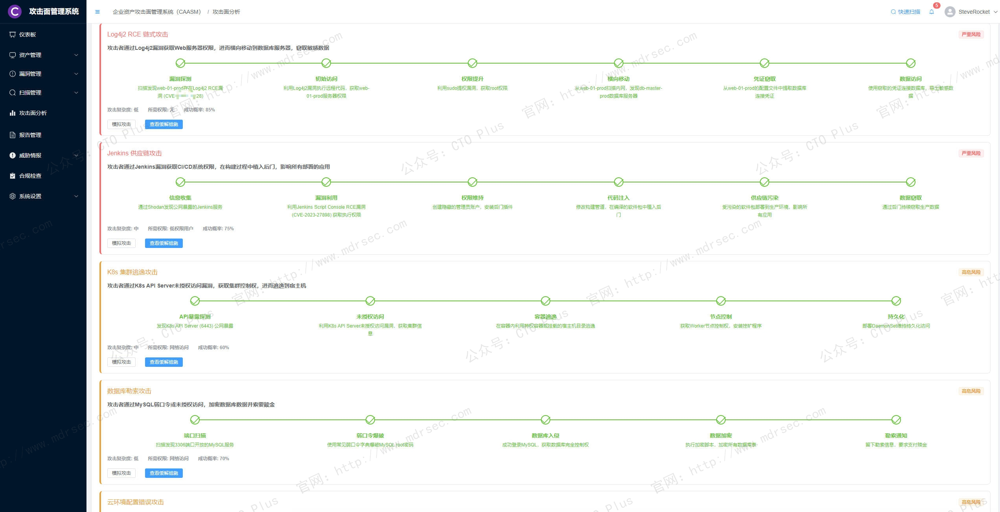
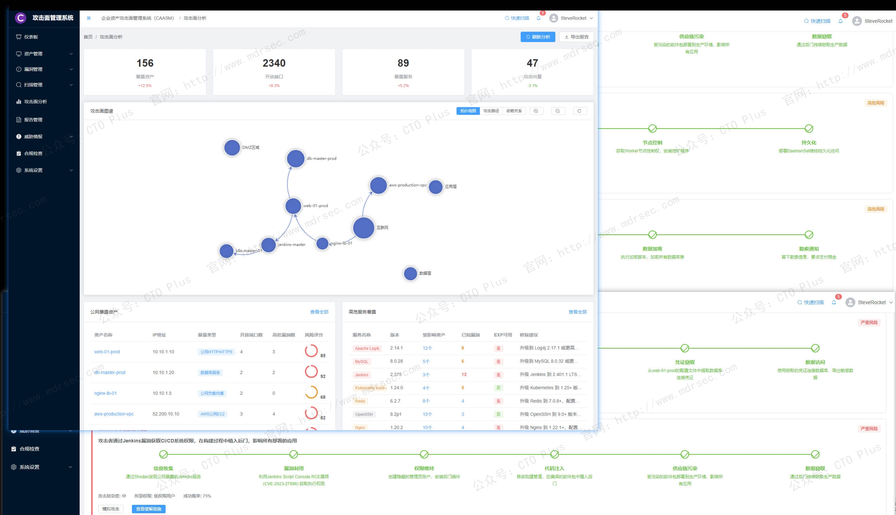
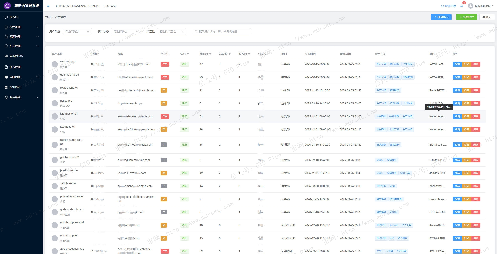

# 企业网络资产攻击面管理系统（CAASM）

## 关于我们

- 官网： http://www.mdrsec.com

我们的技术文章和产品概述欢迎浏览我们的门户。

- 公众号：CTO Plus

最新的动态欢迎关注我们官方唯一公众号。

- 作者QQ

更详细更具体的需求，或者项目合作，或者问题 欢迎联系我。

- QQ群

我们官方组建的QQ群，如果您有兴趣也可以加入我们。

- 请喝咖啡

如果感兴趣，也可以请我喝杯咖啡

## 产品核心功能模块

传统的资产发现工具（如CMDB、主动扫描器）往往受限于数据源孤岛、更新滞后或覆盖不全，导致攻击面管理（ASM）沦为“盲人摸象”。我们的企业网络资产攻击面管理系统（CAASM, Cyber Asset Attack Surface Management）它并非又是一款扫描器，而是一个以资产为中心、以API驱动的数据整合与治理平台，旨在通过打通现有管理系统的数据壁垒，帮助企业构建统一、实时、精准的资产攻击面视图。

在数字化的商业环境中，企业网络资产的数量和类型呈爆炸式增长——从传统的服务器、终端、网络设备，到云主机、容器、API、SaaS应用、物联网传感器，乃至源代码仓库和员工身份凭证。这些资产无处不在，且动态变化，使得安全团队面临一个根本性难题：**“我们究竟保护什么？”**

这里我为大家介绍下我们自研多年的 企业网络资产攻击面管理系统（CAASM） 部分功能模块和核心技术。以下，我将从**产品核心定位**出发，系统性地总结CAASM应具备的**六大核心功能模块**及**三大战略级特性**。

## 部分功能模块

- 功能模块
    - 用户认证与权限管理：完整的登录、权限验证系统
    - 资产管理：资产发现、分类、标签管理
    - 漏洞管理：漏洞生命周期管理、风险评估
    - 扫描管理：自动化扫描、任务调度
    - 报告系统：多种格式报告生成
    - 仪表板：数据可视化、实时监控
    - 系统设置：用户管理、角色权限、集成配置
- 认证授权API
    - 登录/登出/注册
    - 密码管理
    - 两步验证
    - 会话管理
    - 权限控制
    - 个人资料
    - 通知设置
    - API密钥
    - 审计日志
- 资产管理API
    - CRUD操作
    - 批量导入导出
    - 统计分布
    - 端口服务
    - 漏洞关联
    - 扫描历史
    - 变更历史
    - 备注系统
    - 标签管理
    - 资产发现
- 漏洞管理API
    - CRUD操作
    - 批量操作
    - 状态流转
    - 分配处理
    - 修复期限
    - 评论系统
    - 历史记录
    - 统计分析
    - 趋势图表
    - 导入导出
    - 验证/误报/风险接受
- 扫描管理API
    - CRUD操作
    - 任务控制
    - 状态监控
    - 结果查询
    - 日志查看
    - 统计信息
    - 插件管理
    - 模板管理
    - 报告导出
    - 引擎配置
- 报告管理API
    - 报告生成
    - 下载预览
    - 模板管理
    - 计划任务
    - 分享功能
    - 统计分析
    - 字段配置
- 仪表板API
    - 全局统计
    - 趋势数据
    - 分布图表
    - Top风险
    - 最近活动
    - 合规状态
    - 威胁情报
- 攻击面地图
    - 拓扑视图/地理视图/网络视图切换
    - 节点详情展示
    - 图例说明
    - 缩放控制和导出功能
- 生成报告
    - 完整的报告配置表单
    - 资产报表/漏洞报表专项配置
    - 报告样式配置
    - 实时生成进度展示
- 报告模板管理
    - 模板创建/编辑/复制/删除
    - 样式配置（主题色、字体、Logo）
    - 内容配置（封面、目录、图表）
    - 字段配置（资产字段、漏洞字段）
    - 自定义CSS/脚本支持
    - 模板预览和导入导出
- 合规标准管理
    - 标准列表展示（等级保护、ISO 27001、PCI DSS、GDPR等）
    - 合规率进度展示
    - 标准创建/编辑/复制/删除
    - 检查项列表查看
    - 立即执行合规检查
- 合规报告
    - 报告统计（总数、通过率、平均合规率）
    - 报告列表和筛选
    - 报告生成（月度/季度/年度/专项）
    - 报告下载、预览、删除
    - 批量导出功能

## CAASM的核心功能

### 1. 无侵入式多源资产数据融合（核心引擎）

我们CAASM的第一个核心能力是 **“连接与归一化”** ，而非重复“发现”。

* **功能描述**：通过预置的API连接器或无代理集成，主动对接企业内部已有的各类数据源，包括但不限于：
    * **IT运维系统**：CMDB、IPAM、DNS、DHCP。
    * **安全控制点**：EDR、NDR、防火墙策略、WAF、HIDS。
    * **云平台**：AWS、Azure、GCP、阿里云的资源管理API。
    * **身份与访问**：AD/AAD、IDaaS、PAM系统。
    * **开发与供应链**：容器编排平台（K8s）、代码仓库（Git）、CI/CD管道、软件物料清单（SBOM）库。
    * **漏洞管理**：VM扫描结果、BAS模拟报告。

* **产品价值**：无需部署额外探针，零业务影响。通过数据联邦与融合，解决 **“同一个IP对应三个不同归属、一台云主机在CMDB中不存在”** 等经典数据冲突问题。

### 2. 统一资产图谱与动态属性建模

采集多源数据后，我们CAASM构建一个**可查询、可关联、可演化的资产本体模型**。

* **核心功能**：
    * **资产类型全覆盖**：物理/虚拟/云/容器/OT/IoT/应用/API/数据存储/身份/凭证/密钥。
    * **关系自动推导**：例如“Web服务器A（IP x.x.x.x）运行Apache（版本2.4）→ 暴露端口443 → 对应证书（过期时间）→ 所属业务部门（CRM）→ 责任人（张三）”。
    * **属性标准化**：为每一类资产定义至少30+元属性（ID、标签、生命周期状态、暴露等级、关键度、最后发现时间等）。
    * **资产变更追踪**：对比不同时间点的快照，高亮显示新增、消失、配置漂移的资产。

* **产品价值**：从“离散的资产列表”升级为**一张活的资产知识图谱**，为后续的攻击面分析提供上下文基础。

### 3. 攻击面分析与暴露面自动枚举

基于统一的资产图谱，CAASM开始执行其核心分析逻辑：**“找出所有可能被攻击者触达的资产及路径”**。

* **关键分析能力**：
    * **互联网暴露面自动发现**：识别所有拥有公网IP、公有DNS记录、云负载均衡、开放入站端口（尤其是高危端口如3389, 22, 445, 1433, 3306）的资产，并与影子IT（Shadow IT）进行比对。
    * **非标准端口与服务指纹**：不依赖常见端口映射，而是通过服务响应特征识别运行在非标准端口的数据库、管理后台、开发框架。
    * **证书与加密弱点**：发现过期、自签名、弱加密算法的SSL/TLS证书及其关联域名。
    * **API暴露面**：识别未认证、过度权限、未限速的API端点，尤其针对微服务和Serverless架构。
    * **错误配置与安全隐患**：云存储桶可公开读写、安全组规则过宽（0.0.0.0/0）、S3桶ACL错误、Kubernetes RBAC过度授权。
    * **供应链关联暴露**：基于SBOM分析使用的开源组件及其已知漏洞（CVE），以及对外部第三方服务（如Google Analytics、Facebook Pixel）的调用。

* **产品价值**：从被动等待漏洞报告，转变为**主动绘制攻击者的“地图”**，回答“攻击者首先会看到我们的什么资产？”

### 4. 漏洞与暴露的优先级关联（风险量化）

仅有攻击面列表还不够，我们的CAASM与漏洞/威胁情报联动，回答“哪个暴露最危险”。

* **核心能力**：
    * **实时漏洞映射**：将资产属性（OS/服务/版本）与CVE、CNVD、漏洞扫描结果自动关联，标注“受漏洞影响的暴露资产”。
    * **利用可行性评估**：整合EPSS（漏洞利用预测评分）、KEV（已知被利用漏洞目录）、威胁情报IoC，过滤掉“低概率利用”的理论漏洞。
    * **业务上下文加权**：根据资产关键度（核心交易库 vs 测试机）、数据敏感度、暴露范围（公网 vs 内网）动态计算风险评分，例如 **“核心CRM系统 + 公网暴露 + Log4j + EPSS > 0.9 = 立即处置”**。
    * **攻击路径模拟**：基于资产关系图，模拟从外部攻击点到关键资产的多跳攻击路径（例如：公网Web服务器 → 跳板机 → 域控 → 数据库）。

* **产品价值**：终结安全团队陷入的“漏洞海啸”，**将数千个漏洞压缩为数十个真实高风险点**，实现可行动化的优先级排序。

### 5. 策略与合规的自动验证（策略即代码）

CAASM不仅是“看”，更是“验证”——持续检查实际状态与预期策略的偏差。

* **验证场景**：
    * **安全基线与漂移检测**：例如“所有公网Web服务器必须禁用TLS 1.0”、“数据库实例不得绑定EIP”。CAASM自动扫描资产图谱，找出不合规资产。
    * **网络策略验证**：给定防火墙规则或安全组，模拟是否允许从任意源IP访问特定敏感端口；或者反向验证“是否存在一条允许any-to-any的隐含规则”。
    * **暴露面收敛进度验证**：安全团队要求“月底前关闭所有非80/443公网端口”，CAASM可每日生成差异报告，显示已关闭、新增、遗漏的端口。
    * **合规报表自动生成**：针对等保2.0、GDPR、PCI-DSS、ISO 27001中关于资产管理、访问控制、漏洞管理的条款，一键生成证据图谱。

* **产品价值**：将安全策略从“文档”转化为**可编程、可度量的持续控制验证**，推动安全治理左移至设计阶段。

### 6. 闭环修复与编排响应（CTI + SOAR集成）

CAASM的终点不是报告，而是修复。因此需要与IT运维和安全工单系统深度集成。

* **闭环动作**：
    * **精准责任定位**：基于资产图谱中的责任人、部门标签、CMDB owner，自动指派修复工单至具体团队或个人。
    * **修复建议可执行化**：不仅说“打补丁”，而是提供“对于主机A，执行`apt update && apt upgrade openssl`”或“对于AWS安全组sg-xxx，移除入站规则源IP 0.0.0.0/0”。
    * **修复验证**：在工单完成后，CAASM再次拉取相关数据源，确认攻击面已收敛，否则重新触发流程。
    * **自动化阻断（高风险场景）** ：对接WAF、云防火墙、NAC，对于确认正在被利用的暴露（例如CVE-2024-6387公开后且扫描到未修复的公网SSH），可自动下发临时阻断策略。

* **产品价值**：将安全分析结果转化为**可度量、可追踪、可自动化的修复工作流**，缩短MTTR（平均修复时间）从数天到数小时。

---

## 二、CAASM与传统工具的核心差异

以上是功能模块，以下则是我们CAASM的**特性设计原则**。

### 特性一：非破坏性、无代理的“影子CMDB”

传统主动扫描会干扰业务（高频扫描导致服务抖动）、漏掉云原生瞬时资产（容器生命周期短）、无法获取非网络可达资产（IoT、OT）。CAASM的一部分能力是 **“借力”**——通过API直接从权威系统（vCenter、AWS API、K8s API Server、EDR）读取资产数据，既实时又无侵入。它本质上是一个**资产数据湖**，而非探测引擎。

### 特性二：图数据库驱动的关联分析架构

关系型数据库无法高效表达“资产-漏洞-暴露-路径”的多对多、多层嵌套关系。我们的CAASM产品底层采用图数据库（如Neo4j、Amazon Neptune），将资产、端口、服务、漏洞、证书、用户、权限等建模为节点和边。这使得以下查询变为秒级：

* “找出所有通过SSH公钥可以访问核心数据库的跳板机”
* “列出与已知被黑域名的证书由同一CA签发的所有公网资产”
* “模拟攻击者从互联网IP出发，绕过现有防火墙到达敏感S3桶的所有路径”

### 特性三：持续、近乎实时的状态感知

攻击面是动态的——新开云实例、关闭防火墙端口、上线API版本、证书过期、CVE被加入KEV。我们的CAASM支持**增量数据拉取**和**事件驱动更新**（例如Webhook接收云服务商资产变更事件）。典型要求：从代码提交到攻击面更新不超过15分钟。与之对比，传统CMDB是T+1甚至周更。

---

## 三、CAASM在企业安全架构中的定位

**CAASM不是替代品，而是“胶水层”与“真相之源”。**

* 它**不替代**漏洞扫描器、EDR、CMDB，而是将它们的数据整合为统一视图。
* 它**不直接**拦截攻击，但为WAF、NGFW、SOAR提供精准的策略输入。
* 它**不取代**人工渗透测试，但将攻击面枚举的工作量减少80%以上。

**最终业务价值可归纳为：**

1. **消除盲点**：发现未被CMDB记录、被扫描器遗漏、存在于云/容器中的影子资产。
2. **降低噪点**：通过优先级关联，让安全团队不再淹没在低危漏洞中。
3. **缩短时间**：从“发现暴露”到“定位责任人”到“验证修复”的全流程从数周压缩至小时级。
4. **支撑合规**：提供不可篡改的资产变更审计轨迹和策略合规证据链。

对于CISO及安全团队而言，部署CAASM意味着从 **“我们大概知道有什么资产”** 的混沌状态，进化为 **“任何时刻，我们都能回答每一个暴露资产是谁的、为什么暴露、有多危险、该找谁修”** 的确定状态。

攻击面管理不是一次性的资产盘点，而是一场持续对抗信息熵增的战争。

更多功能模块和演示系统环境，如有需求和问题欢迎联系咨询我们。 http://www.mdrsec.com

## 产品清单

### 企业网络安全运营中心产品

- 资产安全配置管理系统（SCMDB）
- 终端侦测与响应系统（EDR）
- 网络侦测与响应系统（NDR）
- 企业网络资产攻击面管理系统（CAASM）
- 资产暴露面管理系统（AEMS）
- 网络安全蜜罐管理系统（HoneyPot）
- 安全事件收集与告警管理系统（SIEM）
- 扩展侦测与响应系统（XDR）
- 多引擎脆弱性扫描系统（VAS）
- 多源日志审计监测系统（LAS）
- 网络安全威胁情报中心（TIS）
- 网络安全漏洞库管理系统（VDBS）
- 网络安全编排与自动化响应（SOAR）
- 威胁狩猎系统（THS）
- 数据库安全审计系统（DSAS）
- AI智能体安全态势管理系统（AISPM）
- Web防火墙（WAF）
- 网站安全监测平台（WSM）
- 网络安全态势感知平台（SSAP）
- 网络安全自动化应急响应工具系统（NSRT）
- 企业网络安全运维工具系统（SecTools）
- 网络安全自动化等保测评系统（ASES）
- 浏览器安全监测防护系统（BSMPS）
- 网络安全用户实体行为分析系统（UEBA）
- 互联网电信诈骗预警防护系统（TPFWS）
- 云原生安全管理平台（CNAPP）
- 自动化渗透测试系统（PTS）
- 工业企业信息安全监测中心（IoT SOC）
- 企业智能安全运营中心（AISOC）

### 企业自动化运维产品

- 运维智能监控告警管理平台（AIMAMS）
- 企业网络工具系统（NTools）
- 自动化测试系统（AutoTest）
- 自动化运维系统（AutoOps）
- 企业运维工具系统（OpsTools）
- 物联网管理系统（IoTS）
- 软件开发生命周期管理系统（SDLC）
- IT流程管理系统（ITSM）

### 企业数字化运营资源管理系统产品

- 制造执行管理系统（MES）
- 运输管理系统（TMS）
- 跨境电商企业资源管理系统（ERP）
- 企业客户关系管理系统（CRM）
- 跨境电商仓库管理系统（WMS）
- 财务管理系统（FMS）
- 质量管理系统（QMS）
- 精准营销管理系统（PMS）
- 智能生产管理系统（SPMS）
- 电商BI系统（BI）
- 智能互联网分布式爬虫系统（AISpider）

## ABOUT

**【关于我们】**

* [主页：http://116.205.137.183/index_pro.html](http://116.205.137.183/index_pro.html)
* [Articulate v1.0](https://mp.weixin.qq.com/s/0yqGBPbOI6QxHqK17WxU8Q)
* [Articulate v2.0](https://mp.weixin.qq.com/s/V5Axn-ZWi22ubh5Jiocb9g)

 🥰

## Contact

  
**< 微信公众号 >**

  
**< QQ技术交流群 >**

**< 联系作者 >**

## **【代码工程系列】**

* [Python和Go的设计模式](https://github.com/zrf-rocket/DesignPattern)
    * GitHub：https://github.com/zrf-rocket/DesignPattern
    * Gitee：https://gitee.com/SteveRocket/design_pattern

* [Python、Go的编码技巧cookbook](https://github.com/zrf-rocket/CookBook)
    * GitHub：https://github.com/zrf-rocket/CookBook
    * Gitee：https://gitee.com/SteveRocket/cook-book

* [Go代码示例](https://github.com/zrf-rocket/PracticeGo)
    * GitHub：https://github.com/zrf-rocket/PracticeGo
    * Gitee：https://gitee.com/SteveRocket/practice_go

* [Python代码示例](https://github.com/zrf-rocket/PracticePython)
    * GitHub：https://github.com/zrf-rocket/PracticePython
    * Gitee：https://gitee.com/SteveRocket/practice_python

* [Python Web框架的示例代码](https://github.com/zrf-rocket/PythonFramework)
    * GitHub：https://github.com/zrf-rocket/PythonFramework
    * Gitee：https://gitee.com/SteveRocket/python_framework
    * Django：https://github.com/zrf-rocket/PythonFramework/tree/master/django_framework
    * Flask：https://github.com/zrf-rocket/PythonFramework/tree/master/flask_framework

* [Python 爬虫框架和技术](https://github.com/zrf-rocket/PracticeSpider)
    * GitHub：https://github.com/zrf-rocket/PracticeSpider
    * Gitee：https://gitee.com/SteveRocket/practice_spider

* [Rust代码示例](https://github.com/zrf-rocket/PracticeRust)
    * GitHub：https://github.com/zrf-rocket/PracticeRust
    * Gitee：https://gitee.com/SteveRocket/practice_rust

* [Vue代码示例](https://github.com/zrf-rocket/PracticeVue)
    * GitHub：https://github.com/zrf-rocket/PracticeVue
    * Gitee：https://gitee.com/SteveRocket/practice_vue

* [前端代码示例](https://github.com/zrf-rocket/PracticeFronted)
    * GitHub：https://github.com/zrf-rocket/PracticeFronted
    * Gitee：https://gitee.com/SteveRocket/practice_fronted

* [Python自动化测试框架](https://github.com/zrf-rocket/PythonTestAutomationFramework)
    * GitHub：https://github.com/zrf-rocket/PythonTestAutomationFramework
    * Gitee：https://gitee.com/SteveRocket/python_test_automation_framework

* [Python和Go的算法代码示例](https://github.com/zrf-rocket/Algorithms)
    * GitHub：https://github.com/zrf-rocket/Algorithms
    * Gitee：https://gitee.com/SteveRocket/Algorithms

* [Python和Go的数据结构代码示例](https://github.com/zrf-rocket/DataStructure)
    * GitHub：https://github.com/zrf-rocket/DataStructure
    * Gitee：https://gitee.com/SteveRocket/data_structure

* [编码规范](https://github.com/zrf-rocket/DevGuide)
    * GitHub：https://github.com/zrf-rocket/DevGuide
    * Gitee：https://gitee.com/SteveRocket/develop_guide

* [编码安全规范](https://github.com/zrf-rocket/SecGuide)
    * GitHub：https://github.com/zrf-rocket/SecGuide
    * Gitee：https://gitee.com/SteveRocket/security_guide

## **【产品系列】**

* [安全运营中心（SOC）-威胁情报与漏洞库管理系统](https://github.com/zrf-rocket/tip_platform)
    * GitHub：https://github.com/zrf-rocket/tip_platform
    * Gitee：https://gitee.com/SteveRocket/tip_platform

* [主机监控系统-日志收集与报警管理系统（SIEM）](https://github.com/zrf-rocket/SIEM)
    * GitHub：https://github.com/zrf-rocket/SIEM
    * Gitee：https://gitee.com/SteveRocket/siem

* [安全运营中心（SOC）-终端侦测与响应系统（EDR）](https://github.com/zrf-rocket/EDR_SOC)
    * GitHub：https://github.com/zrf-rocket/EDR_SOC
    * Gitee：https://gitee.com/SteveRocket/edr_soc

* [安全运营中心（SOC）-网络资产攻击面管理（Cyber asset attack surface management）系统](https://github.com/zrf-rocket/CAASM)
    * GitHub：https://github.com/zrf-rocket/CAASM
    * Gitee：https://gitee.com/SteveRocket/caasm

* [安全运营中心（SOC）-信息资产采集与安全评估系统（ICSA）](https://github.com/zrf-rocket/SOC_ICSA)
    * GitHub：https://github.com/zrf-rocket/SOC_ICSA
    * Gitee：https://gitee.com/SteveRocket/SOC_ICSA

* [安全运营中心（SOC）-安全编排与自动化响应（SOAR）](https://github.com/zrf-rocket/soar_platform)
    * GitHub：https://github.com/zrf-rocket/soar_platform
    * Gitee：https://gitee.com/SteveRocket/soar_platform

* [研发测试安全运维一体化平台（DevTestSecOps）](https://github.com/zrf-rocket/DevSecOps-SDLC)
    * GitHub：https://github.com/zrf-rocket/DevSecOps-SDLC
    * Gitee：https://gitee.com/SteveRocket/devsectestops-sdlc

* [安全运营中心（SOC）-Penetration Test-自动化渗透测试平台（PT-PenTest）](https://github.com/zrf-rocket/PenetrationTest)
    * GitHub：https://github.com/zrf-rocket/PenetrationTest
    * Gitee：https://gitee.com/SteveRocket/penetration_test

* [cicd-持续集成持续部署系统（CI/CD）](https://github.com/zrf-rocket/CICD)
    * GitHub：https://github.com/zrf-rocket/CICD
    * Gitee：https://gitee.com/SteveRocket/cicd

* [DevSecTestOps-SDLC-自动化研发安全测试运维一体化平台（DevSecTestOps）](https://github.com/zrf-rocket/DevSecOps-SDLC)
    * 代码自动构建、代码安全审计、自动测试、自动部署、自动接口测试
    * GitHub：https://github.com/zrf-rocket/DevSecOps-SDLC
    * Gitee：https://gitee.com/SteveRocket/dev-sec-ops-sdlc

* [AI图像识别-智能缺陷检测系统]()
    * [基于AI图像识别的工业缺陷检测应用系统（GPU&FPGA）](https://mp.weixin.qq.com/s/04qefQFg-Pg1Gcqq1vBLQQ)
    * [基于AI图像识别的智能缺陷检测系统，在钢铁行业的应用-技术方案](https://mp.weixin.qq.com/s/dSHbnuOwQZzE4CvPr1JYjg)

# CAASM 网络资产攻击面管理（Cyber asset attack surface management）和 EASM 外部攻击面管理（External attack surface management）系统

## 功能特性

## 架构图

